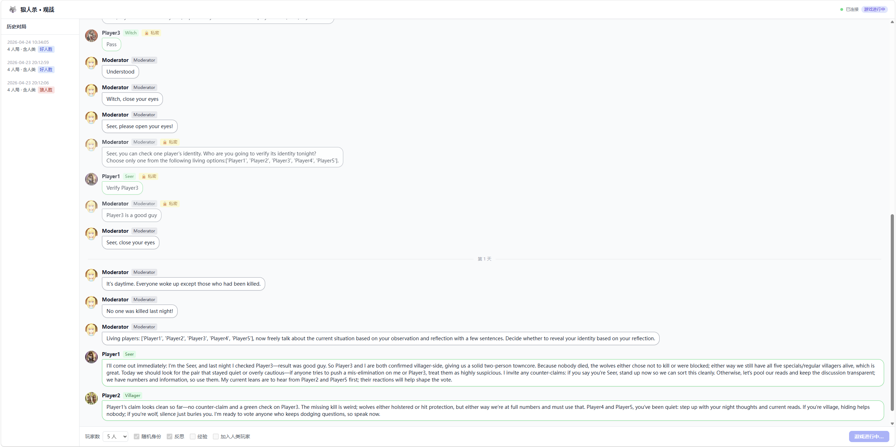
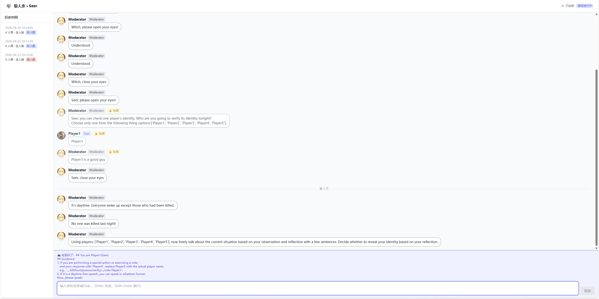

# 基于多智能体的狼人杀游戏 (Werewolf Game)

基于 MetaGPT 框架的多智能体狼人杀游戏系统，支持 AI 角色自主推理、反思和经验学习

## 📖 项目简介

本项目使用大语言模型（LLM）驱动的多智能体系统模拟狼人杀游戏。每个玩家由独立的 AI 智能体控制，能够进行策略推理、身份伪装、投票决策等复杂游戏行为。系统支持反思机制和经验学习，使 AI 玩家能够从历史游戏中积累经验并优化策略。

### 核心特性

- 🎮 **完整的狼人杀游戏机制**：支持多种角色（狼人、村民、预言家、女巫、猎人、守卫）
- 🤖 **多智能体协作**：基于 MetaGPT 框架的角色系统，每个玩家独立思考和行动
- 🧠 **反思与学习**：AI 玩家能够反思游戏过程并从历史经验中学习
- 👤 **人机混合模式**：支持人类玩家参与游戏
- 📊 **游戏记录与分析**：自动记录游戏过程和统计数据

## 🌐 WebUI

现代化界面

### 模式选择

**观战模式**（显示所有玩家信息，包括身份和夜间行动）



**玩家模式**（仅显示与自己角色相关的信息，隐藏其他玩家身份）



### 功能说明

- **观战模式**：以上帝视角观看完整对局，所有角色身份、夜间行动、私密消息均可见
- **玩家模式**：以指定角色身份参与游戏，只接收属于自己的信息，不泄露其他玩家身份
- **历史回放**：UI左侧边栏查看历史对局列表，支持回放任意一局的完整消息记录
- **实时推送**：游戏消息通过 WebSocket 实时推送到前端

---

## �🚀 快速开始

### 环境要求

- Python 3.10.15
- 支持 OpenAI API 格式的 LLM 服务

### 安装步骤

1. **克隆项目**
```bash
git clone https://github.com/Vicgothicoi/Werewolf.git
cd <project-directory>
```

2. **安装依赖**
```bash
cd frontend
npm install
```

```bash
pip install -r requirements.txt
```


3. **配置 API**

复制配置示例文件并填入你的 API 信息：
```bash
cp config/config_example.yaml config/config.yaml
```

编辑 `config/config.yaml`：
```yaml
OPENAI_API_BASE: "YOUR_API_URL"
OPENAI_API_KEY: "YOUR_API_KEY"
OPENAI_API_MODEL: "YOUR_MODEL_NAME"
```

### 运行游戏

1. **启动 Redis**（用于持久化对局记录）
```bash
docker-compose up -d
```

2. **启动后端服务**
```bash
python start_game.py
```

3. **启动前端**
```bash
npm run dev
```

前端默认运行在 `http://localhost:3000`，后端 API 在 `http://localhost:8000`。

在浏览器中打开前端页面，点击"开始游戏"即可，支持通过界面选择是否加入人类玩家等。

### 参数说明

| 参数 | 类型 | 默认值 | 说明 |
|------|------|--------|------|
| `player_num` | int | 5 | 玩家数量（4-10） |
| `n_round` | int | 100 | 最大游戏回合数 |
| `investment` | float | 20.0 | 游戏投资（控制 LLM 调用预算） |
| `add_human` | bool | False | 是否添加人类玩家 |
| `shuffle` | bool | False | 是否随机分配角色 |
| `use_reflection` | bool | True | 是否启用反思机制 |
| `use_experience` | bool | False | 是否使用历史经验 |
| `use_memory_selection` | bool | False | 是否启用记忆选择 |
| `new_experience_version` | str | "" | 新经验版本标识 |


## �️ 技术栈

```
┌─────────────────────────────────────────────────────────────────┐
│                         浏览器 / 用户                            │
│              React 18 + TypeScript + Tailwind CSS               │
│                    (frontend/src/, port 3000)                   │
└──────────────────────────┬──────────────────────────────────────┘
                           │  WebSocket (/ws)  &  HTTP REST
                           ▼
┌─────────────────────────────────────────────────────────────────┐
│                    FastAPI 后端服务                              │
│              werewolf_game/server.py  (port 8000)               │
│  • /game/start  启动对局                                         │
│  • /games       历史对局列表                                     │
│  • /ws          实时消息推送 + 人类玩家输入                       │
└──────────┬──────────────────────────────────┬───────────────────┘
           │  asyncio.create_task             │  aioredis
           ▼                                  ▼
┌──────────────────────────┐      ┌───────────────────────────────┐
│     游戏引擎（核心）      │      │         Redis                 │
│  werewolf_game/          │      │  持久化对局消息 & meta         │
│  ├── werewolf_game.py    │      │  (docker-compose, port 6379)  │
│  ├── roles/              │      └───────────────────────────────┘
│  │   ├── moderator.py    │
│  │   ├── base_player.py  │
│  │   └── (各角色)        │
│  └── actions/            │
│      └── (各动作)        │
└──────────┬───────────────┘
           │  LLM API 调用（OpenAI 兼容格式）
           ▼
┌─────────────────────────────────────────────────────────────────┐
│                    MetaGPT 框架                                 │
│  metagpt/  (Role / Action / Memory / Environment / LLM)         │
└──────────────────────────┬──────────────────────────────────────┘
                           │  HTTP / HTTPS
                           ▼
                  ┌─────────────────┐
                  │   LLM 服务      │
                  │ (OpenAI / 兼容) │
                  └─────────────────┘
```

| 层级 | 技术 | 说明 |
|------|------|------|
| 前端 | React 18 + TypeScript + Vite + Tailwind CSS | 实时对局界面，WebSocket 通信 |
| 后端 | FastAPI + uvicorn | REST API + WebSocket 服务 |
| 消息持久化 | Redis (aioredis) | 存储对局消息和元数据，支持历史回放 |
| 游戏引擎 | Python (werewolf_game/) | 角色逻辑、流程控制、经验管理 |
| 多智能体框架 | MetaGPT | Role / Action / Memory 抽象层 |
| LLM | OpenAI API 兼容接口 | 驱动所有 AI 玩家的推理与决策 |


## 🎯 游戏角色

### 狼人阵营
- **狼人 (Werewolf)**：夜晚选择击杀一名玩家，白天需要伪装身份

### 好人阵营
- **村民 (Villager)**：普通村民，通过推理找出狼人
- **预言家 (Seer)**：每晚可以查验一名玩家的身份
- **女巫 (Witch)**：拥有一瓶解药和一瓶毒药，可以救人或毒人
- **猎人 (Hunter)**：被击杀时可以开枪带走一名玩家
- **守卫 (Guard)**：每晚可以守护一名玩家

### 主持人
- **Moderator**：控制游戏流程，宣布游戏结果


## 📁 项目结构

```
werewolf_game/
├── actions/                    # 游戏动作定义
│   ├── common_actions.py      # 通用动作（发言、反思等）
│   ├── moderator_actions.py   # 主持人动作
│   ├── werewolf_actions.py    # 狼人动作（击杀）
│   ├── seer_actions.py        # 预言家动作（查验）
│   ├── witch_actions.py       # 女巫动作（救人/毒人）
│   ├── hunter_actions.py      # 猎人动作（开枪）
│   ├── guard_actions.py       # 守卫动作（守护）
│   └── experience_operation.py # 经验存储与检索
├── roles/                      # 角色定义
│   ├── base_player.py         # 玩家基类
│   ├── moderator.py           # 主持人
│   ├── werewolf.py            # 狼人
│   ├── villager.py            # 村民
│   ├── seer.py                # 预言家
│   ├── witch.py               # 女巫
│   ├── hunter.py              # 猎人
│   ├── guard.py               # 守卫
│   └── human_player.py        # 人类玩家接口
├── schema.py                   # 数据模型定义
└── werewolf_game.py           # 游戏主类
```

## 🎮 游戏流程

1. **游戏初始化**：分配角色，主持人宣布游戏开始
2. **夜晚阶段**：
   - 狼人睁眼，选择击杀目标
   - 女巫睁眼，决定是否使用解药或毒药
   - 预言家睁眼，查验一名玩家身份
   - 守卫睁眼，选择守护对象
3. **白天阶段**：
   - 主持人宣布夜晚死亡情况
   - 玩家依次发言讨论
   - 投票淘汰可疑玩家
   - 猎人被淘汰时可以开枪
4. **胜利判定**：
   - 好人胜利：所有狼人被淘汰
   - 狼人胜利：所有村民或所有特殊角色被淘汰

## 🔧 技术架构

- **框架**：MetaGPT（多智能体协作框架）
- **LLM**：支持 OpenAI API 格式的任意模型
- **核心技术**：
  - 提示词工程 + Function Calling
  - 经验增强决策（短期记忆 + 长期经验）
  - “确定性工作流+随机决策节点”的多智能体架构设计
  - 多智能体调度与一致性控制

## 📝 开发说明

### 添加新角色

1. 在 `werewolf_game/roles/` 创建新角色类，继承 `BasePlayer`
2. 在 `werewolf_game/actions/` 定义角色特殊动作
3. 在 `start_game.py` 的 `init_game_setup()` 中添加角色配置

### 自定义游戏规则

修改 `werewolf_game/roles/moderator.py` 中的游戏流程控制逻辑


